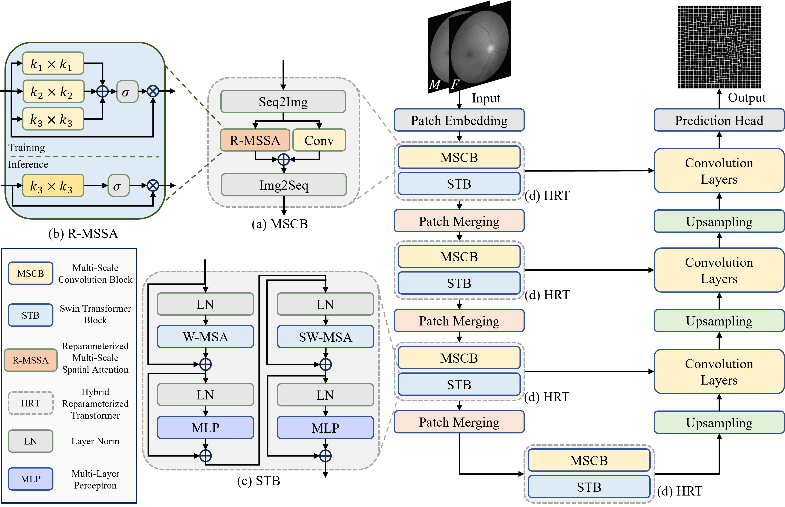

# RMFormer
Reparameterized Multi-scale Transformer for Deformable Retinal Image Registration

[Paper Link]() will be available soon.

## Datasets

- [FIRE: Fundus Image Registration Dataset](https://projects.ics.forth.gr/cvrl/fire/)
- [OASIS: Open Access Series of Imaging Studies](https://learn2reg.grand-challenge.org/evaluation/task-3-validation/leaderboard)

We used OASIS dataset processed by Junyu Chen [[here](https://github.com/junyuchen245/TransMorph_Transformer_for_Medical_Image_Registration)].

## Running

### Training

Set `train_dir` and `val_dir` to your path in `train_RMFormer.py` line 32-33.

Then, simply run `python train_RMFormer.py` will start the training process.

### Testing

Set `test_dir` to your path in `infer_RMFormer.py` line 45.

Then, simply run `python infer_RMFormer.py` will start the testing process.

## Acknowledgment

This repo is heavily based on Junyu Chen's code ([junyuchen245/TransMorph_Transformer_for_Medical_Image_Registration: TransMorph](https://github.com/junyuchen245/TransMorph_Transformer_for_Medical_Image_Registration)). Thanks for their contribution!
